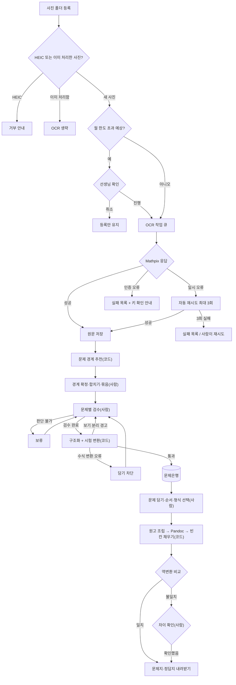
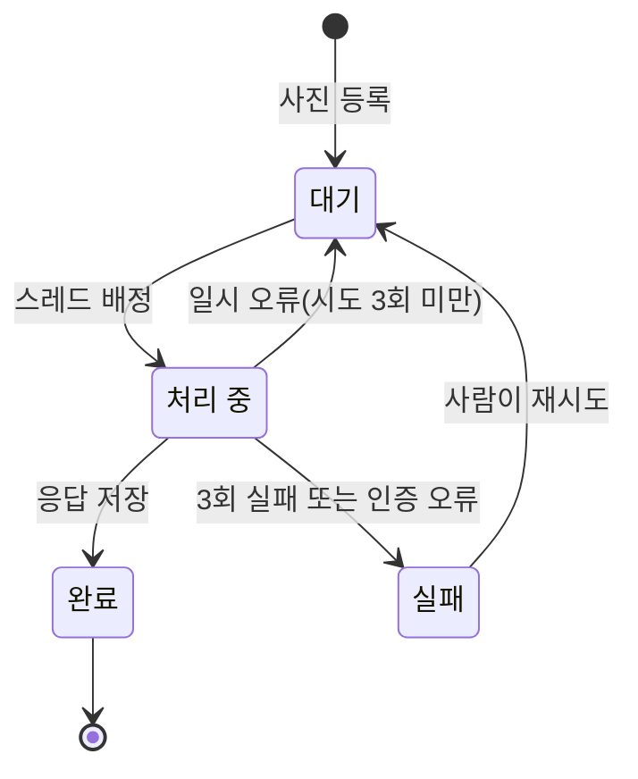
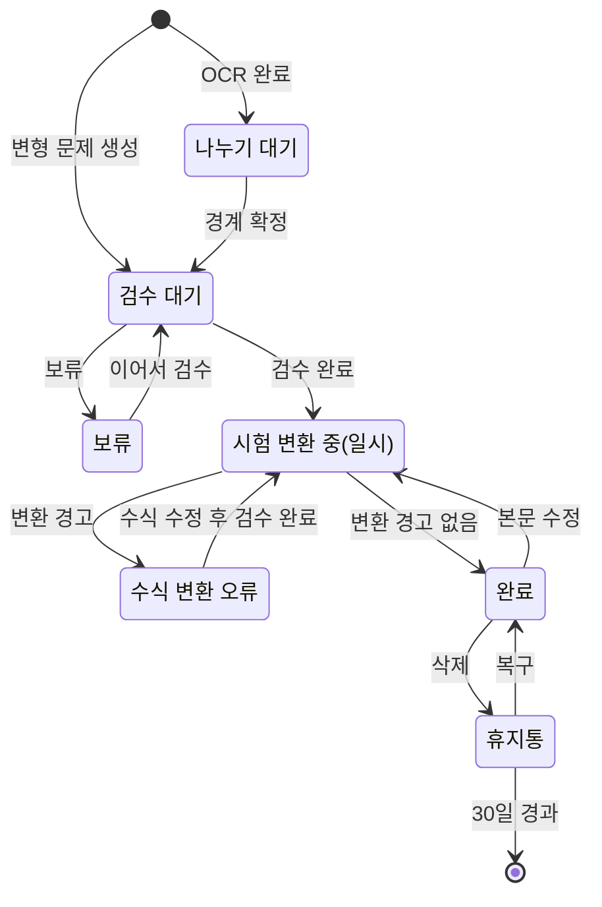
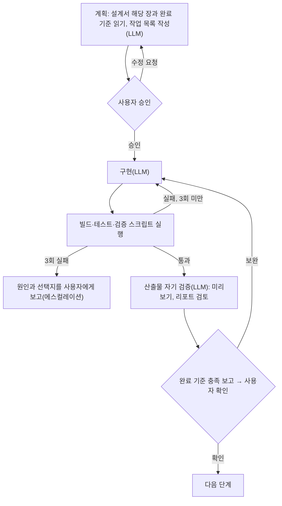

# 수학 문제지 생성 프로그램 설계서

Oct 3, 2026 · @김혜원 (Oct 4, 2026 인터뷰 반영 개정)

## 1. 개요

**배경**: 학원에서는 여러 문제집과 학교 기출에서 필요한 문제를 골라 수업·시험용 문제지를 만든다. 문제를 옮겨 적는 데 시간이 많이 들고, 특히 분수·루트·적분 같은 수식에서 오류가 생기기 쉽다. 범용 AI로 사진을 옮기면 빠르지만 원문을 "자연스럽게" 고쳐 쓰는 위험이 있어 문제지 용도로는 믿기 어렵다. 그래서 수식 전용 OCR로 옮기고, 사람이 원본과 대조해 확정하고, Word 변환은 규칙대로 동작하는 코드가 맡는 구조를 택했다.

학원 PC 한 대에서 돌아가는 웹 프로그램이다. 문제집 쪽 사진 폴더를 넣으면 OCR, 문제 나누기, 사람 검수, 문제은행 저장을 거쳐 Word 문제지를 만든다. 원본 문제를 한 글자도 바꾸지 않고 옮기는 것이 최우선 원칙이다.

**사용자**: 학원 선생님 여러 명. 개발 지식이 없으며, 학원 네트워크 안에서 브라우저로 접속한다. 평소 시험지는 한글(HWP)로 다루고 Word는 열 수 있는 정도다. 검수는 선생님들이 수업 준비 틈틈이 하며 주 50문제 이하를 예상한다.

**핵심 원칙**

- **원본 그대로 전사**: 받아쓰기는 수식 전용 OCR(Mathpix)이 맡고, 서식 정리는 정해진 규칙대로 동작하는 코드가 맡는다. AI는 문제 본문을 고쳐 쓰지 않는다.
- **사람 검수 필수**: 원본 사진과 결과를 나란히 보고 확정한 문제만 문제은행에 들어간다.
- **바로 인쇄 가능한 결과**: 선생님이 Word에 익숙하지 않으므로, 내려받은 문제지는 손대지 않고 인쇄할 수 있어야 한다. 풀이 공간, 문제가 단·쪽에서 잘리지 않는 배치, 그림 크기는 프로그램이 책임진다. Word 편집은 가끔 손보는 용도다.
- **비용 최소화**: 서버 비용 0원. 매달 드는 돈은 OCR API 사용료뿐이다.
- **쉬운 사용**: 설치는 서버 PC 한 대에만 한다. 나머지 선생님은 주소만 열면 된다.

**운영 원칙**

- **깨끗한 책 촬영**: 풀이 흔적이 없는 책을 찍는 것을 원칙으로 한다. Mathpix는 한글 손글씨를 지원하지 않아 자동 제거를 신뢰할 수 없기 때문이다. 손글씨 자동 판별·색 펜 제거 기능은 MVP에서 뺀다.
- **저작권**: 학교 기출, 학원 자체 제작 자료처럼 권리가 분명한 자료 위주로 운영한다(12장).

**입출력 정의**

| 구분 | 항목 | 형식 | 비고 |
| --- | --- | --- | --- |
| 입력 | 쪽 사진 | JPG, PNG (HEIC 거부) | 폰 촬영 또는 복합기 스캔. `문제사진\학년\교재명\등록폴더\` 규칙 권장 |
| 입력 | 업로드 묶음 정보 | 교재명, 학년 | 폴더 경로에서 자동으로 채움 |
| 입력 | 검수 입력 | 문제 경계, 본문·수식 수정, 유형, 정답, 태그, 그림 영역 | 검수 화면 |
| 입력 | 문제지 구성 | 문제 목록과 순서, 제목, 날짜, 형식, 문제별 풀이 공간 | 문제지 만들기 화면 |
| 입력 | 형식 파일 | .docx (필수 스타일 13개, 빈칸 4개) | 내장 2~3종 + 등록 |
| 입력 | 설정 | Mathpix 키, 학원명, 백업 위치, 월 한도, 포트 | 서버 PC 전용 |
| 외부 | Mathpix 요청·응답 | 이미지(multipart) / JSON(`text`, `line_data`) | 응답은 원문 그대로 보관 |
| 출력 | 문제지 | .docx (수식은 Word 기본 수식) | PDF는 Word에서 저장 |
| 출력 | 정답지 | .docx (빠른 정답표 + 정답 표시 문제지) | 문제지와 같은 문제지 번호 |
| 출력 | 문제은행 | H2 DB + 이미지 파일 | `%APPDATA%\MathWorksheet\` (10장) |
| 출력 | 백업 | H2 압축본 14벌 + 이미지 증분 사본 | 외장 하드 또는 Google Drive |
| 출력 | 문제 상황 보내기 | .zip (최근 로그, 앱 버전, 설정 요약) | API 키 제외 |

**제약조건**

- **실행 환경**: Windows 데스크톱 1대. 선생님 업무용 PC를 겸하며 매일 켜고 끈다.
- **네트워크**: 학원 내부망 전용, 로그인 없음. 외부 통신은 Mathpix 호출뿐이다.
- **비용**: 서버·라이선스 비용 0원. 변동비는 Mathpix 사용료뿐이다.
- **AI 사용**: 프로그램 안에서 생성형 AI(LLM)를 쓰지 않는다. AI 모델은 Mathpix OCR 하나이며, 그 결과는 사람 검수로 확정한다.
- **원문 불변**: 문제 본문을 자동으로 정리·보정하는 코드를 두지 않는다.
- **사용자**: LaTeX를 모르고 Word에 익숙하지 않다. 노트북(1366px)에서도 검수할 수 있어야 한다.
- **규모**: 문제 1~3만 개, 쪽 사진 약 1만 장.
- **개발·배포**: 1인 개발(Claude Code 활용), 방문 설치로 업데이트한다.
- **저작권**: 학교 기출·자체 제작 자료 위주로 운영한다(12장).

**용어 정의**

| 용어 | 뜻 |
| --- | --- |
| 쪽 사진 | 문제집 한 쪽을 통째로 찍거나 스캔한 사진. 기본 입력 단위 |
| 업로드 묶음 | 사진 등록 한 번. 교재명·학년이 묶음 단위로 들어간다(UploadBatch) |
| 문제 나누기 | 쪽 사진을 문제 단위로 자르는 단계. 코드가 경계를 추천하고 사람이 확정한다 |
| 문제 영역 | 사진 위에서 한 문제가 차지하는 사각형. 두 장에 걸친 문제는 영역이 2개다(ProblemRegion) |
| 묶음 문제 | `[1~2]`처럼 공통 지문·그림을 공유하는 문제들(ProblemGroup) |
| 원번호 | 원래 교재에 적힌 문제 번호. 문제지의 새 번호와 구분한다 |
| 원문 | Mathpix가 돌려준 결과 그대로의 텍스트와 줄 데이터. 수정하지 않는다(OcrResult) |
| 검수본 | 사람이 원문을 확인·수정해 확정한 문제 본문(Problem) |
| 검수 | 원본 사진과 대조해 본문·수식·유형·정답을 확정하는 사람의 작업 |
| 보류 | 판단이 어려운 문제를 메모와 함께 미뤄 둔 상태 |
| 시험 변환 | 검수 완료 직후 문제 하나를 Pandoc으로 docx 변환해 수식 변환 오류를 찾는 검사 |
| 검색용 텍스트 | 본문에서 LaTeX 명령어를 걷어 낸 검색 전용 문자열 |
| 원고 | 문제지를 만들기 위해 프로그램이 조립한 마크다운(Pandoc 구역 표시 포함) |
| 형식 파일 | 문제지 서식을 정하는 reference.docx. 본문은 쓰이지 않고 스타일·페이지·머리말만 쓰인다 |
| 필수 스타일 | 형식 파일에 반드시 있어야 하는 영문 이름의 Word 스타일 13개(8장) |
| 빈칸 | 형식 파일의 `{{학원명}}` 같은 자리 표시. 생성 시 입력값으로 바뀐다 |
| 풀이 공간 | 문제 뒤에 넣는 빈 높이. 유형별 기본값에 작게·보통·크게 배율 |
| 스냅샷 | 문제지 생성 시점의 문제 내용 사본. 저장된 문제지를 그대로 재현한다 |
| 문제지 번호 | 문제지마다 붙는 고유 번호(예: WS-0042). 문제지와 정답지의 짝을 맞춘다 |
| 역변환 비교 | 만든 docx를 다시 마크다운으로 바꿔 원고와 글자 단위로 대조하는 검증 |
| 변형 문제 | 기존 문제를 복제해 숫자 등을 바꾼 새 문제. 원본과 연결된다 |
| 서버 PC 전용 기능 | `localhost` 접속일 때만 열리는 설정·형식 등록·삭제 기능 |

## 2. 요구사항

필수 기능 11개로 MVP를 구성한다. AI는 사진을 읽는 OCR(Mathpix)에만 쓴다.

| ID | 기능 요구사항 | 구분 |
| --- | --- | --- |
| F1 | 사진 일괄 등록: 서버 PC에서는 폴더 경로 붙여넣기, 다른 PC에서는 브라우저 폴더 선택 업로드. 등록할 때 교재명과 학년을 한 번 입력(폴더 규칙을 따르면 자동으로 채움) | 필수 |
| F2 | Mathpix로 한글과 수식을 인식해 LaTeX 수식이 든 마크다운 생성 | 필수 |
| F3 | 쪽 사진 한 장을 문제 단위로 자동 분할하고, 경계를 사람이 조정. 두 장에 걸친 문제 합치기, 공통 지문 묶음 지정 | 필수 |
| F4 | 원본 사진과 수식 렌더링 결과를 나란히 보며 수정하고 확정. 수식은 클릭해서 시각 편집기로 고침 | 필수 |
| F5 | 그림·그래프 영역을 지정해 이미지로 잘라 저장(회전, 흑백 정리, 지우개) | 필수 |
| F6 | 본문, 보기, 그림으로 나눠 저장하고 출처·학년·유형·정답·태그 기록 | 필수 |
| F7 | 문제은행 검색과 필터(교재, 학년, 유형, 태그, 정답 입력 여부, 본문 검색), 등록 시간순 정렬 | 필수 |
| F8 | 문제를 골라 순서를 정하면 번호를 새로 매겨 Word 문제지 생성, 수식은 Word에서 편집 가능 | 필수 |
| F9 | 문제지 서식 템플릿 선택(1단/2단, 보기 배치, 유형별 풀이 공간) | 필수 |
| F10 | 정답지를 별도 파일로 생성(문제지만 / 정답지만 / 둘 다). 첫 쪽에 빠른 정답표 | 필수 |
| F11 | 변형 문제: 기존 문제를 복제해 숫자 등을 바꾼 새 문제로 저장(원본과 연결) | 필수 |

**하지 않는 것(MVP)**: 단원 분류, 문제 사용 이력 관리, 해설 저장, 중복 문제 검사, 손글씨 자동 제거, 색 펜 전처리, 서버 PDF 생성, HWPX 출력.

**비기능 요구사항**

- **정확성**: 문제 본문은 검수 화면에서 사람이 고치는 경우에만 바뀐다. Word 생성 후 역변환 비교로 원고와 일치하는지 자동 검증한다(8장).
- **비용**: 클라우드를 쓰지 않는다. 서버는 학원에 있는 PC를 쓴다.
- **사용성**: 선생님은 아무것도 설치하지 않는다. LaTeX와 Spring 같은 기술을 몰라도 쓸 수 있어야 한다. 노트북(1366px)에서도 검수할 수 있어야 한다.
- **동시 사용**: 학원 안에서 여러 명이 동시에 접속해도 된다. 같은 문제를 두 명이 고치면 나중에 저장한 사람에게 충돌을 알린다.
- **규모**: 수년 안에 문제 1\~3만 개, 쪽 사진 약 1만 장을 감당한다.
- **보존**: 문제은행은 매일 자동 백업한다.
- **보안**: API 키는 서버 PC에만 두고, 학원 내부망에서만 접속을 허용한다. 학원 와이파이는 선생님만 쓰므로 로그인은 두지 않는다.

## 3. 시스템 구성과 배포

학원 PC 한 대에 설치 파일을 깔아 서버로 쓰고, 다른 선생님은 같은 네트워크에서 브라우저로 접속한다. 외부로 나가는 통신은 Mathpix OCR API 호출뿐이다.

&#91;embedded content: 시스템 구성 · 서버 PC 1대, 외부 API는 Mathpix 1개\]

- **서버 PC**: 선생님 한 명이 매일 쓰는 데스크톱을 서버로 겸한다. 학원 문을 열면 켜고 닫으면 끈다. 따라서 상시 가동을 전제로 한 기능(밤 시각 백업 등)은 두지 않는다.
- **설치 파일**: jpackage로 Spring Boot 앱, JRE, pandoc.exe를 Windows 설치 파일 하나로 묶는다. 서버 PC에 Java를 따로 설치하지 않는다.
- **실행**: Windows 로그인 때 자동으로 켜진다. 작업 표시줄 트레이 아이콘이 "실행 중 · 접속 주소"를 보여주고, 아이콘을 누르면 브라우저가 열린다. 실수로 끄지 않도록 종료는 트레이 메뉴에서 확인 후에만 한다.
- **접속**: 다른 PC는 `http://서버PC주소:8080`을 북마크해 쓴다. 포트는 설정 화면에서 바꿀 수 있다.
- **사진 입력**: 폰으로 찍거나 복합기로 스캔한 사진을 PC의 폴더에 모은 뒤 등록한다. 서버 PC에서는 폴더 경로 붙여넣기, 다른 PC에서는 폴더 선택 업로드. 폴더 자동 감시는 하지 않는다. 사람이 교재와 사진을 확인하고 OCR을 시작해야 실수와 비용을 통제할 수 있다.
- **확장 대비**: 나중에 클라우드로 옮겨도 코드는 그대로 쓴다. 이미지 저장소와 OCR 엔진만 인터페이스로 분리해 둔다.

## 4. 기술 스택과 도구 사용 방식

Spring Boot와 React로 만들고, 받아쓰기는 Mathpix, Word 변환은 Pandoc에 맡긴다. 모든 구성 요소는 설치 파일 하나에 묶여 서버 PC에 들어간다. 개발은 1인(Claude Code 활용)이며 기한에 여유가 있으므로 로드맵 순서대로 테스트를 갖추며 진행한다.

| 영역 | 도구 | 쓰는 방식 |
| --- | --- | --- |
| 백엔드 | Spring Boot 3, Java 21 | REST API, OCR 작업 큐, 파일 처리, Pandoc 실행 |
| DB | H2 파일 모드 + JPA, Flyway | 문제·그림·문제지 저장. 스키마 변경은 Flyway로 관리. 동시 수정은 JPA `@Version` 낙관적 잠금 |
| 프론트엔드 | React + Vite | 빌드 결과를 Spring Boot의 static 폴더에 넣어 한 프로그램으로 배포 |
| 수식 표시 | KaTeX | 검수 화면과 문제은행에서 LaTeX를 렌더링 |
| 수식 편집 | MathLive | 수식을 클릭하면 보이는 모양 그대로 고치는 팝업 편집기. 결과는 LaTeX로 저장 |
| 본문 편집기 | CodeMirror 6 | 마크다운 편집, 수식 구간 강조, 변환 오류 수식 밑줄 |
| 그림 자르기 | react-image-crop | 화면에서 그림 영역을 드래그하면 좌표를 서버로 전송 |
| 이미지 처리 | Java ImageIO | 원본 해상도로 잘라 PNG 저장, 회전 보정, 흑백 정리, 그림 지우개 적용, 검수 후 원본 축소 |
| OCR | Mathpix API (v3/text) | 사진 1장당 1회 호출. include\_line\_data로 줄별 좌표를 받아 문제 분할에 쓴다. 받은 Mathpix Markdown을 원문으로 보관 |
| 텍스트 비교 | java-diff-utils | Word 역변환 결과와 원고 비교 |
| 문서 생성 | Pandoc + reference.docx + Lua 필터 | 마크다운을 Word로 변환. 수식은 Word 기본 수식(OMML)이 된다 |
| 배포 | jpackage + WiX Toolset | JRE와 pandoc.exe를 포함한 Windows 설치 파일 생성 |
| 백업 | Spring @Scheduled | 앱이 켜진 뒤 30분, 이후 24시간마다 DB와 새 이미지를 지정 위치로 복사 |
| 개발 환경 | VS Code (Java, Spring Boot 확장) | 개발과 디버깅 |

**선택 이유**

- **H2를 SQLite보다 우선**: JPA가 기본 지원해서 추가 라이브러리가 필요 없다. 학원 규모의 동시 접속과 3만 문제는 충분히 감당한다. 실행 중에도 `BACKUP TO`로 안전하게 백업할 수 있다.
- **본문 검색은 LIKE**: 문제마다 LaTeX 명령어를 걷어 낸 "검색용 텍스트" 칸을 따로 두고 `LIKE '%등비수열%'`로 찾는다. 3만 건이면 수십 ms 안에 끝나고, 한국어 형태소 분석이 필요한 전문 검색 엔진보다 단순하다.
- **Pandoc**: LaTeX 수식을 Word 기본 수식으로 바꿔 주는 사실상 유일한 무료 도구다. Mathpix식 수식 표기(`\(...\)`, `\[...\]`)가 Word 수식으로 정상 변환되는 것을 확인했다.
- **MathLive**: 선생님은 LaTeX를 모른다고 가정한다. 사람이 눌러 고친 수식만 LaTeX가 다시 쓰이고, 손대지 않은 수식은 Mathpix 원문 그대로 남는다.
- **Mathpix 결과를 원문으로 보관**: 검수본과 별도로 남겨 두면, 나중에 무엇이 고쳐졌는지 추적할 수 있다.

## 5. 처리 파이프라인

사진은 8단계를 거쳐 문제지가 된다. AI는 2단계 OCR에만 쓰이고, 나머지는 모두 정해진 규칙대로 동작하는 코드다. 문제 본문이 바뀔 수 있는 곳은 4단계(사람 검수) 하나뿐이다. 1\~6단계(사진 → 문제은행)와 7\~8단계(문제은행 → 문제지)는 따로 실행되므로, 사진을 추가하지 않고 기존 문제은행만으로 문제지를 만들 수 있다.

1. **사진 등록**
   - 서버 PC에서는 폴더 경로를 붙여넣는다. 다른 PC에서는 브라우저의 폴더 선택(`webkitdirectory`)으로 사진 전체를 올린다.
   - 등록 한 번이 "업로드 묶음" 하나다. 묶음마다 교재명(이전 입력 자동완성)과 학년을 입력하면, 그 묶음에서 나온 문제에 모두 들어간다. 쪽 번호는 필요하면 검수 때 입력한다.
   - **폴더 규칙 자동 입력**: 선생님에게는 `문제사진\학년\교재명\등록폴더\` 규칙을 안내한다([사진 폴더 정리 규칙](사진%20폴더%20정리%20규칙.md)). 등록한 폴더의 경로가 이 모양이면 위 두 단계 폴더 이름에서 학년(`중1`~`고3`, `기타`)과 교재명을 읽어 입력칸을 미리 채운다. 브라우저 업로드에서는 `webkitRelativePath`로 같은 정보를 얻는다. 규칙과 다르면 빈칸으로 두고 선생님이 입력한다. 교재명이 기존 교재와 비슷하지만 다르면(띄어쓰기 차이 등) "기존 교재 '쎈 중2-1'이 맞나요?"를 묻는다.
   - 한 쪽 전체를 찍은 사진이 기본이다. 문제 하나만 찍은 사진도 그대로 처리된다(분할 결과가 1개일 뿐이다).
   - 파일명 순으로 정렬한다. 파일명 규칙은 강제하지 않는다.
   - 파일마다 SHA-256 해시를 저장한다. 이미 처리한 사진은 다시 OCR하지 않아 비용이 들지 않는다.
   - 아이폰은 촬영 설정을 JPG로 바꿔 둔다(HEIC 대신). 등록 화면에서 HEIC 파일은 안내와 함께 거부한다.
   - 이번 달 예상 요금이 설정한 월 한도를 넘게 되면 OCR 시작 전에 확인 창을 띄운다.
2. **OCR 작업**
   - 사진 1장이 작업 1건이다. 상태는 대기, 처리 중, 완료, 실패로 관리한다.
   - `@Async` 스레드 풀로 2\~4건씩 동시에 처리하고, 실패하면 3회까지 재시도한 뒤 실패 목록에 올린다.
   - Mathpix 요청에 `include_line_data`를 켜서 줄마다 사진 속 좌표를 받는다.
   - Mathpix 응답은 수정하지 않은 원문 그대로 저장한다. 호출 수와 줄 수를 기록해 사용량 화면에 쓴다.
3. **문제 나누기**
   - 줄 첫머리가 문제 번호 모양(`12.`, `1203`, `[1~2]` 등)인 곳에서 끊어 문제 경계를 추천한다. 추천한 번호는 원번호로 저장한다.
   - 검수 화면 첫 단계에서 원본 사진 위에 경계를 가로선으로 보여준다. 선생님이 선을 끌어 옮기거나 추가·삭제해 확정한다.
   - **두 장에 걸친 문제**: "다음 사진과 합치기"로 앞 사진의 마지막 영역과 다음 사진의 첫 영역을 한 문제로 잇는다. 문제 하나가 사진 여러 장의 영역을 순서대로 참조한다.
   - **공통 지문**: `[1~2]`처럼 여러 문제가 지문·그림을 공유하면 "묶음"으로 지정한다. 공통 지문과 하위 문제가 한 묶음으로 저장된다.
   - 경계가 확정되면 문제마다 독립된 검수 대기 문제가 생긴다. 나뉜 문제는 다른 선생님이 이어서 검수할 수 있다.
4. **사람 검수**
   - 원본 사진(해당 문제 영역 강조), 편집기, 수식 미리보기를 한 화면에 둔다.
   - 수식은 미리보기나 편집기에서 클릭하면 MathLive 팝업이 열려 분수·루트 버튼으로 고친다. 한글 오탈자는 편집기에서 직접 고친다.
   - 그림 영역을 지정하고, 그림 위 보조선·메모는 흰색 지우개 붓으로 지운다.
   - 유형(객관식 / 단답형 / 서술형)은 보기 ①이 발견되면 객관식, 아니면 단답형으로 미리 골라 두고 선생님이 바꾼다.
   - 정답: 객관식이면 ①\~⑤ 버튼, 단답형·서술형이면 한 줄 입력칸(수식 가능). 서술형은 최종 답만 적는다. 정답이 비어 있으면 "검수 완료" 때 입력을 요구하되, "나중에 입력"을 체크하면 정답 없이 등록한다.
   - 태그는 자유 입력(예: 킬러, 기출변형)이며 이전 태그를 자동완성한다.
   - 판단이 안 서는 문제(흐린 사진, 지나치게 복잡한 수식)는 "보류"와 한 줄 메모를 남기고 다음 문제로 넘어간다. 보류 목록에서 누구든 이어서 처리한다.
   - "검수 완료"를 누르면 바로 다음 문제로 넘어가고, 서버가 뒤에서 Pandoc 시험 변환을 한다(아래 5단계).
   - 저장할 때 다른 선생님이 먼저 같은 문제를 고쳤다면 "다른 분이 먼저 수정했습니다"를 띄우고 최신 내용을 다시 불러온다.
5. **구조화와 시험 변환**
   - 정규식으로 본문, 보기 ①\~⑤, `<보기>` 상자(ㄱ, ㄴ, ㄷ), 그림 표시를 나눈다. 글자 자체는 건드리지 않는다.
   - 객관식인데 보기 번호가 ①부터 연속으로 4개 또는 5개로 나뉘지 않으면 검수 화면에 경고를 띄운다.
   - 문제 하나짜리 원고를 Pandoc으로 docx 변환해 본다(약 0.2\~0.5초, 화면을 멈추지 않음). "Could not convert TeX math" 경고가 나오면 문제를 "수식 변환 오류" 상태로 바꾸고 해당 수식을 빨갛게 표시한다. 오류가 풀릴 때까지 문제은행에서 담을 수 없다. KaTeX로는 보이지만 Word 수식으로 바뀌지 않는 LaTeX를 여기서 잡는다.
   - (선택) 편집 중 입력이 1\~2초 멈추면 같은 시험 변환을 미리 돌려 문제 수식에 밑줄을 친다.
6. **문제은행 저장**
   - 검수본, 구조화 결과, 그림, 메타데이터, 검색용 텍스트를 함께 저장한다.
   - 사진에서 나온 문제가 모두 검수 완료되고 그림도 다 잘랐으면, 원본 사진을 긴 변 2000px JPEG(약 0.5MB)로 줄여 보관한다. "원본 보기"에는 충분하다. 이후 그림을 다시 자르면 화질이 떨어질 수 있다고 안내한다.
7. **문제지 생성**
   - 문제를 고르고 순서를 정하면, 1번부터 일련번호를 새로 매겨 마크다운으로 조립한다. 유형과 관계없이 전부 일련번호이며, 묶음 문제는 `[3~4]`처럼 번호가 자동으로 매겨진다.
   - 생성 시점의 문제 내용을 문제지에 스냅샷으로 복사해 둔다. 저장된 문제지를 다시 내려받으면 만들 당시 내용이 그대로 나온다.
   - 정답지는 같은 원고에 정답 표시 옵션을 켜서 한 번 더 변환한다.
   - Pandoc으로 Word를 만든 뒤 역변환 비교로 검증한다(8장). 다르면 어느 문제의 어느 부분이 다른지 보여주고 "확인했음, 내려받기" 버튼을 준다. 시험 직전에 막히지 않도록 차단하지는 않는다.
8. **최종 마무리**
   - 내려받은 Word를 그대로 인쇄하는 것이 목표다. 필요할 때만 Word에서 손보고, PDF는 Word에서 저장한다. 서버는 PDF를 만들지 않는다.

**흐름도**



**처리 주체 구분**

런타임 프로그램에는 LLM 판단 단계가 없다. 판단이 필요한 곳은 모두 사람이 맡고, 나머지는 규칙대로 동작하는 코드가 맡는다. LLM 판단은 개발 단계에만 있다(14장).

| 영역 | 담당 | 해당 단계 |
| --- | --- | --- |
| 사람 판단 | 선생님 | 업로드 묶음 정보 확인, 월 한도 초과 시 진행 여부, 문제 경계 확정, 본문·수식 수정, 유형·정답·태그, 그림 영역, 보류, 비교 불일치 시 내려받기 여부 |
| 외부 AI 모델 | Mathpix | 사진 → 텍스트·수식·줄 좌표. 결과는 원문으로 보관하고 사람이 확정한다 |
| 코드(규칙) | Spring Boot, Pandoc, Lua 필터 | 해시·중복 검사, 작업 큐·재시도, 경계 추천(정규식), 구조화, 시험 변환, 저장, 원고 조립, Word 생성, 빈칸 채우기, 역변환 비교, 백업 |
| LLM 판단 | 없음 | 런타임에는 두지 않는다 |

**상태 전이: OCR 작업(OcrJob)**



**상태 전이: 문제(Problem)**



- 정답만 고치는 경우는 시험 변환을 거치지 않고 "완료"에 머문다.
- **문제지 생성**은 한 번에 끝나는 작업이라 저장 상태를 두지 않는다. 흐름은 조립 → 변환 → 빈칸 채우기 → 역변환 비교 → (일치) 내려받기 / (불일치) 사람 확인 후 내려받기다.

**단계별 성공 기준·검증·실패 처리**

검증 유형은 스키마 검증, 규칙 기반, 사람 검토 중에서 고른다. 런타임에는 LLM 자기 검증이 없다.

| 단계 | 성공 기준 | 검증 방법 | 실패 시 처리 |
| --- | --- | --- | --- |
| 1. 사진 등록 | 모든 파일이 JPG/PNG이고 해시가 계산됨. 교재명·학년이 입력됨 | 스키마(확장자, 필수 필드) | HEIC는 거부 안내 후 나머지만 등록(스킵 + 로그). 필수값 누락은 입력 요구, 월 한도 초과 예상은 확인 창(에스컬레이션) |
| 2. OCR | HTTP 성공, `text`가 비어 있지 않고 `line_data`가 있음 | 스키마(응답 필드) | 네트워크·5xx는 자동 재시도 최대 3회(간격을 늘려 가며). 인증·결제 오류는 재시도하지 않고 키 확인 안내(에스컬레이션). 3회 실패는 실패 목록(에스컬레이션) |
| 3. 문제 나누기 | 모든 줄이 정확히 한 문제 영역에 속함(겹침·누락 없음). 사람이 경계를 확정함 | 규칙(영역 겹침·누락 검사) + 사람 검토 | 번호 패턴이 하나도 없으면 사진 전체를 1문제로 추천하고 사람이 조정(에스컬레이션) |
| 4. 사람 검수 | 유형 지정, 정답 입력 또는 "나중에 입력" 체크, "검수 완료" 클릭 | 규칙(필수 필드) + 사람 검토 | 판단 불가는 보류(에스컬레이션). 버전 충돌은 최신 내용 다시 불러오기(에스컬레이션) |
| 5. 구조화·시험 변환 | 객관식 보기가 ①부터 연속 4~5개. Pandoc 수식 변환 경고 없음 | 규칙 | 보기 분리 실패는 검수 화면 경고(에스컬레이션). 수식 변환 오류는 상태 전환·담기 차단(에스컬레이션). Pandoc 프로세스 오류는 자동 재시도 1회 후 로그 |
| 6. 문제은행 저장 | 트랜잭션 커밋, 검색용 텍스트 생성, 그림 파일 존재 | 스키마 + 규칙(파일 존재) | 저장 실패는 롤백 후 오류 표시(에스컬레이션). 원본 축소 실패는 원본 유지(스킵 + 로그) |
| 7. 문제지 생성 | docx 생성, `{{` 빈칸 잔존 없음, 그림 누락 없음, 역변환 비교 일치 | 규칙(빈칸·그림 검사) + 역변환 비교 | Pandoc 실패는 자동 재시도 1회 후 오류 표시. 비교 불일치·그림 누락은 차이를 보여주고 사람이 내려받기 결정(에스컬레이션) |
| 8. 최종 마무리 | 선생님이 그대로 인쇄함 | 사람 검토 | Word에서 손봄 |
| 형식 파일 등록 | 필수 스타일 13개, 빈칸 4개 존재 | 규칙 | 등록 거부 + 빠진 항목을 문장으로 표시(에스컬레이션) |
| 백업 | DB 압축본 생성, 새 이미지 복사 수 일치 | 규칙 | 다음 주기에 자동 재시도. 마지막 백업이 24시간을 넘으면 경고(에스컬레이션) |

## 6. 데이터 모델

OCR 원문(OcrResult)과 검수본(Problem)을 분리해, 원문은 절대 수정하지 않는다. 문제지(WorksheetItem)는 문제 내용의 스냅샷을 가져 문제은행이 바뀌어도 그대로 재현된다.

| 엔티티 | 주요 필드 | 설명 |
| --- | --- | --- |
| UploadBatch | id, 교재명, 학년, 폴더명, 등록일 | 사진 등록 한 번 |
| SourceImage | id, uploadBatchId, 파일 경로, sha256, 축소 여부, 등록일 | 등록한 사진 1장 |
| OcrJob | id, sourceImageId, 상태, 시도 횟수, 오류 메시지 | OCR 작업 큐 |
| OcrResult | id, sourceImageId, 엔진(현재 mathpix), 원문, 줄별 데이터(JSON), 생성일 | 읽기 전용 원문 |
| Problem | id, groupId, 묶음 안 순서, originProblemId, 교재, 학년, 쪽, 원번호, 유형, 정답, 정답 상태(입력됨/나중에), 본문 마크다운, 검색용 텍스트, 검수 상태, 보류 메모, version, 삭제일, 생성일, 수정일 | 검수 중이거나 마친 문제. 본문은 발문(보기 ①~⑤ 제외), `<보기>` 상자는 본문 안 `::: bogi` 구역 |
| ProblemRegion | problemId, sourceImageId, 좌표(x, y, 너비, 높이), 순서 | 문제가 차지하는 사진 영역. 두 장에 걸치면 2개 |
| ProblemGroup | id, 공통 지문 마크다운 | 공통 지문 묶음 |
| Choice | problemId, 번호(1\~5), 내용 마크다운, 이미지형 여부 | 객관식 보기 |
| Figure | id, problemId 또는 groupId, 표시 이름(본문의 `[그림:p0123_1]`), 파일 경로, 순서, 표시 너비 | 잘라낸 그림 |
| Tag / ProblemTag | 이름 / problemId, tagId | 자유 태그 |
| Template | id, 이름, reference.docx 경로, 단 수, 단 너비(cm), 보기 배치 기준 칸 수(5개/3개), 유형별 풀이 공간(cm), 내장 여부 | 문제지 서식 |
| Worksheet / WorksheetItem | 제목, 날짜, templateId, 생성일, 수정일, 복제 원본 문제지, 문제지 번호(예: WS-0042) / problemId, 순서, 풀이 공간(작게/보통/크게), 스냅샷(JSON), 스냅샷 당시 문제 version | 만든 문제지와 문제 순서 |
| ApiUsage | 연월, 호출 수, 페이지 요금 추정 건수 | Mathpix 사용량 집계 |

- **검수 상태**: 나누기 대기 → 검수 대기 → (보류) → 수식 변환 오류 → 완료. 완료된 문제만 문제은행에 보인다.
- **변형 문제**: "복제해서 변형"으로 만든 새 Problem이며 `originProblemId`에 원본을 기록한다. 정답은 새로 입력해야 한다. 원본은 바뀌지 않는다.
- **스냅샷과 갱신**: 저장된 문제지를 열 때 스냅샷 이후 수정된 문제가 있으면 "3번 문제가 수정됨 → 최신으로 갱신" 버튼을 보여준다. 누르지 않으면 만들 당시 내용 그대로다.
- **삭제**: 휴지통으로 옮긴 뒤(삭제일 기록) 30일이 지나면 실제로 지운다. 저장된 문제지는 스냅샷이 있어 삭제된 문제도 그대로 다시 내려받을 수 있다. 삭제와 복구는 서버 PC에서만 한다.
- 이미지와 템플릿 파일은 DB가 아닌 디스크에 두고, DB에는 경로만 저장한다.

**사용자 구분은 두지 않는다.** 로그인과 선생님 엔티티 없이 생성일과 수정일만 기록한다. 이름만 고르는 방식은 책임 추적 용도로 신뢰도가 낮고 매번 입력 단계만 늘린다. 무엇이 바뀌었는지는 OCR 원문 보관으로 추적할 수 있다.

**문제 사용 이력은 관리하지 않는다.** 어느 반에 어떤 문제를 냈는지는 선생님이 관리한다. 필요해지면 WorksheetItem에서 "이 문제가 들어간 문제지" 목록을 보여주는 것으로 시작한다.

## 7. 화면 설계

화면은 8개이고 두 갈래로 나뉜다. 사진 등록, 작업 현황, 검수는 문제은행을 채우는 화면이다. 문제은행, 문제지 만들기, 저장된 문제지는 사진 없이 문제은행만으로 문제지를 만드는 화면이다. 가장 공을 들일 곳은 검수 화면으로, 정확도가 여기서 결정된다.

| 화면 | 하는 일 |
| --- | --- |
| 사진 등록 | 폴더 경로 입력 또는 폴더 선택 업로드, 교재명(자동완성)·학년 입력, 사진 미리보기, 예상 비용 표시, OCR 시작 |
| 작업 현황 | OCR 진행률, 실패 목록과 재시도 버튼, 나누기 대기·검수 대기·보류·수식 변환 오류 목록 |
| 검수 | ① 나누기 단계: 쪽 사진 위 경계선 조정, 합치기, 묶음 지정. ② 문제별 단계: 원본 영역, 편집기, 미리보기(수식 클릭 편집), 그림 영역 드래그, 유형·정답·쪽·태그 입력, "보류", "검수 완료" |
| 문제은행 | 교재·학년·유형·태그·정답 미입력 필터, 본문 검색, 등록 시간순 정렬. 렌더링된 문제 카드 목록, 카드마다 "원본 보기", "담기", "복제해서 변형". 정답은 카드에서 바로 수정(재검수 불필요) |
| 문제지 만들기 | 담은 문제 목록. 드래그로 순서 변경(번호 자동 재부여), 빼기, 문제별 풀이 공간(작게/보통/크게). 제목·날짜 입력, 형식 선택, 내려받기(문제지만 / 정답지만 / 둘 다) |
| 저장된 문제지 | 만든 문제지 목록. 다시 열어 문제와 순서를 바꾸고 새로 내려받거나, 복제해서 새 문제지의 출발점으로 쓴다. 수정된 문제가 있으면 갱신 버튼 |
| 휴지통 | 삭제한 문제 목록과 복구(서버 PC 전용) |
| 설정 | 서버 PC(localhost)에서만 열린다. Mathpix API 키 입력과 연결 테스트, 이번 달 호출 수·예상 요금·월 한도, 백업 위치와 마지막 백업 시각, 학원명, 형식 파일 등록·내려받기·만들기 프롬프트, "문제 상황 보내기"(로그 내보내기) |

**검수 화면 배치**

- 1600px 이상: 원본 | 편집기 | 미리보기 3단.
- 그보다 좁은 화면(노트북 1366\~1536px): 원본 | [미리보기 / 편집기] 탭 2단. 수식은 미리보기에서 클릭해 고칠 수 있으므로 대부분의 수정은 미리보기 탭에서 끝난다.
- 편집기 내용이 바뀌면 미리보기가 즉시 갱신된다.
- 키보드: Ctrl+Enter 검수 완료 후 다음, Ctrl+S 저장, Alt+H 보류. 주 50문제 규모이므로 단축키는 이 정도로 충분하다.
- 문제별 단계에서는 원본 사진에서 해당 문제 영역만 강조하고 나머지는 흐리게 보인다.

**문제가 보이는 형태**

- 문제은행과 문제지 만들기에서는 수식을 KaTeX로 렌더링해 최종 문제지에 가깝게 보여준다. 그림도 함께 표시한다.
- 마크다운 원문은 검수 화면에서만 보인다.
- 원본 사진은 "원본 보기" 버튼으로 필요할 때만 펼친다.
- 생성된 Word에서 고친 내용은 그 파일에만 남고 문제은행에는 반영되지 않는다. 문제 자체를 고치려면 검수 화면에서 수정하고, 숫자만 바꾼 출제는 "복제해서 변형"을 쓴다.

## 8. 문제지 서식과 Word 생성

서식은 형식 파일(.docx)이 정하고, 내용은 문제은행에서 만든 원고가 정한다. 선생님은 문제지마다 제목(예: "율현중 1-2 중간고사")만 입력한다. 샘플 문제 4개로 2단, 머리말 빈칸, 보기 자동 배치가 동작하는 것을 확인했다.

| 구성 요소 | 누가, 언제 | 담는 것 |
| --- | --- | --- |
| 형식 파일 | 개발자가 내장 2\~3종 제작. 추가 형식은 선생님이 프롬프트로 제작 | 용지·여백·2단, 글꼴·크기·줄간격, 필수 스타일 13개, 머리말·꼬리말과 빈칸 |
| 형식 설정 | 형식 파일 등록 시 | 유형별 기본 풀이 공간(예: 객관식 1cm, 단답형 3cm, 서술형 8cm), 보기 배치 기준 칸 수(예: 5/10). 형식 파일 옆 같은 이름의 `.json` |
| 입력값 | 선생님, 문제지마다 | 제목, 형식 선택. 날짜는 오늘로 자동(수정 가능). 학원명은 설정의 기본값 |
| 원고(마크다운) | 프로그램, 자동 | 고른 문제와 "문제, 보기, 보기상자, 묶음 지문, 풀이 공간" 표시. 서식 정보는 없음 |

**형식 파일 규격**

- **시작점**: `pandoc --print-default-data-file reference.docx`로 뽑은 기본 파일에 서식을 입힌다. 형식 파일의 본문은 문제지에 쓰이지 않으므로 스타일 견본만 둔다.
- **페이지**: A4, 여백 약 1.8cm, 2단(간격 1cm, 가운데 구분선), 첫 쪽 머리말 따로 지정.
- **머리말**: 첫 쪽은 학원명, 제목, 날짜, 이름 칸(빈칸으로 인쇄). 둘째 쪽부터는 제목과 학원명 한 줄. 꼬리말은 가운데 쪽 번호와 문제지 번호.
- **빈칸**: `{{학원명}}`, `{{시험제목}}`, `{{날짜}}`, `{{문제지번호}}`(꼬리말) 4개. Word가 글자를 쪼개 저장하지 않도록 한 번에 타이핑한다.
- **필수 스타일**: 이름은 영문으로 고정한다. Word 언어 설정과 무관하게 프로그램이 찾을 수 있게 하기 위해서다.

| 스타일 | 종류 | 역할 |
| --- | --- | --- |
| Problem | 단락 | 문제 본문. 내어쓰기, 단·쪽에서 쪼개지지 않게 설정 |
| ProblemNumber | 문자 | 문제 번호(굵게) |
| GroupStem | 단락 | 묶음 문제의 공통 지문(`[3~4]`). 다음 단락과 함께 |
| Choices5 | 단락 | 보기 한 줄에 5개. 같은 간격 탭 5개 |
| Choices3 | 단락 | 보기 한 줄에 3개(3+2 배치). 같은 간격 탭 3개 |
| Choices1 | 단락 | 보기 한 줄에 1개 |
| BogiTitle | 단락 | `<보 기>` 제목 |
| BogiBox | 단락 | `<보기>` 상자. 테두리, 연속 단락은 한 상자로 합쳐짐 |
| Figure | 단락 | 그림 단락. 가운데 정렬, 다음 단락과 함께 |
| Table | 표 | 문제 속 표. 전체 테두리, 가운데 정렬 |
| Answer | 단락 | 정답지의 "정답 ③" 줄. 빨간색 |
| CorrectChoice | 문자 | 정답지에서 정답 보기 강조. 빨간색, 굵게 |
| AnswerTable | 표 | 정답지 첫 쪽의 빠른 정답표 |

**원고 형식**: 프로그램이 문제마다 아래처럼 구역 표시를 붙여 조립한다.

```markdown
::: {.problem num="1" space="1cm"}
함수 \(f(x)=x^{2}-4x+1\)의 최솟값은?
:::

::: choices
① \(-4\)
② \(-3\)
③ \(-2\)
④ \(-1\)
⑤ \(0\)
:::
```

**문제지 생성 순서**

1. **원고 조립**: 문제 본문의 `<`, `>` 앞에 `\`를 붙인다. 붙이지 않으면 `<보기>`가 HTML 태그로 인식되어 사라진다(샘플에서 확인). 내용은 문제은행이 아닌 문제지 스냅샷에서 가져온다.
2. **Pandoc 실행**: `pandoc -f markdown+tex_math_single_backslash --reference-doc=형식파일.docx --lua-filter=worksheet.lua -o out.docx worksheet.md`. Spring Boot가 `ProcessBuilder`로 실행하고, pandoc.exe는 설치 폴더에 함께 들어 있다.
3. **Lua 필터**:
   - 문제 번호와 Word 탭을 앞에 붙인다. 마크다운의 탭 문자는 공백으로 바뀌므로 Word 탭을 직접 넣는다.
   - 보기 너비를 계산해 배치를 고른다. 한글 2칸, 영문·숫자·기호 1칸, 수식은 LaTeX 명령어를 뺀 글자 수로 센다. 가장 긴 보기가 형식 설정의 첫째 기준 이하면 Choices5, 둘째 기준 이하면 Choices3, 그 이상이면 Choices1. 기준은 단 너비·글자 크기에 따라 형식마다 다르다(설정이 없으면 9/15, 내장 내신형 2단은 5/10. 2026-10-06 미리보기에서 9/15가 2단 10pt에 넘치는 것을 확인).
   - 문제 뒤에 `space` 높이만큼 빈 공간을 넣는다(줄 높이를 고정한 빈 단락을 openxml로 삽입). 기본값은 형식의 유형별 풀이 공간이고, 문제지 만들기에서 작게(×0.5)/보통/크게(×2)로 바꾼다.
   - 묶음 문제는 공통 지문과 하위 문제를 "다음 단락과 함께"로 묶어 단·쪽에서 갈라지지 않게 한다.
4. **빈칸 채우기**: 결과 docx의 머리말·꼬리말·본문 XML에서 `{{…}}`를 입력값으로 바꾼다. Java에서는 Apache POI로 처리한다.
5. **검증(역변환 비교)**:
   - 만든 docx를 `pandoc -f docx+styles -t markdown`으로 다시 마크다운으로 바꾼다. `+styles`가 Problem·Choices 같은 스타일 이름을 구역으로 남겨 주므로 문제 단위로 자를 수 있고, 수식은 OMML에서 LaTeX로 돌아온다.
   - 원고와 결과를 정규화한다(비교용만. 아래 목록 외 규칙을 더할 때는 사용자 확인): 공백 제거(폭 없는 공백 U+200B 포함. Pandoc이 수식으로 끝나는 표 칸에 붙인다), `\dfrac`→`\frac`, Word를 거친 `\left\{\begin{matrix}…\end{matrix}\right.`→`\begin{cases}…\end{cases}`(Word 수식에는 cases가 없다), `\left`/`\right` 제거, 불필요한 중괄호 제거.
   - 프로그램이 붙인 번호·탭·정답 줄·정답표·풀이 공간은 비교에서 뺀다.
   - 문제별로 글자 단위 비교하고 수식 개수가 같은지 확인한다. 다르면 문제 번호와 다른 부분을 보여주고 "확인했음, 내려받기"를 허용한다.
6. **마무리**: 대부분 그대로 인쇄한다. 필요하면 Word에서 손보고 PDF는 Word에서 저장한다.

**형식 파일 제작·등록·검사**

- **내장 형식**: 개발자가 학원의 실제 시험지 샘플을 보고 2\~3종(예: 내신형 2단, 숙제형 촘촘한 2단, 1단)을 만들어 설치 파일에 넣는다. 학원명은 설정에서 바꾼다.
- **추가 형식(선생님 제작)**: 설정 화면에서 가장 비슷한 내장 형식 파일과 만들기 프롬프트([형식 파일 만들기 프롬프트](형식%20파일%20만들기%20프롬프트.md))를 내려받는다. 내장 형식은 이미 검사를 통과한 파일이라 출발점으로 쓰면 실패가 적다. 선생님은 원하는 시험지 사진과 함께 Claude 같은 외부 AI 대화창에 넣어 규격에 맞는 docx를 받는다. 프롬프트에는 필수 스타일 13개의 이름과 역할, 빈칸 4개, 2단·머리말 규칙, "스타일 이름은 바꾸지 말 것"이 들어간다. 프로그램 안에는 AI가 들어가지 않는다.
- **등록 검사**: 형식 파일을 올리면 `styles.xml`에서 필수 스타일 13개, 머리말·꼬리말에서 빈칸 4개가 있는지 검사한다. 빠진 것이 있으면 등록을 막고 무엇이 빠졌는지 보여준다. 이 메시지를 그대로 외부 AI에 붙여 넣어 고치게 할 수 있도록 문장으로 보여준다.
- 등록 직후 샘플 문제(객관식·단답형·서술형·묶음·그림·표 포함)로 미리보기 문제지를 만들어 보여준다.
- 형식은 여러 개 등록해 두고 문제지마다 고른다(F9). 형식 등록은 서버 PC 설정 화면에서만 한다.

**확인된 것**: 2단, 첫 쪽 머리말, 꼬리말 쪽 번호가 형식 파일만으로 결과 문서에 적용된다. 별도 후처리가 필요 없다.

**정답지**

- **형태**: 첫 쪽에 빠른 정답표(1-③ 2-① … 형식의 AnswerTable), 그 뒤로 학생용 문제지와 똑같은 문제지에 정답을 표시한 것이다. 채점은 정답표로 빠르게 하고, 문제를 확인할 때는 뒤쪽을 본다.
- **만드는 법**: 같은 원고와 같은 형식 파일로 Pandoc을 한 번 더 실행하되, 정답 표시 옵션(`-M answers=true`)을 켠다. Lua 필터가 이 옵션을 보고 정답표와 정답 표시를 넣는다.
- **객관식**: 정답 보기를 CorrectChoice 스타일(빨간색, 굵게)로 표시한다.
- **모든 문제**: 보기 아래에 Answer 스타일(빨간색) 단락으로 "정답 ③"을 넣는다. 단답형·서술형은 "정답 12"처럼 최종 답을 넣는다.
- **서술형**: 해설은 넣지 않는다. 최종 답 아래 풀이 공간을 학생용과 같이 남겨 두어, 선생님이 필요하면 인쇄한 정답지에 직접 적는다. 정답지는 보통 1부만 뽑으므로 기능을 더 늘리지 않는다.
- **정답 미입력 문제**: 정답표와 문제 아래에 "정답 미입력 · 출처: 교재명 52쪽 1203번"을 표시해 해답을 바로 찾을 수 있게 한다.
- **문제지 번호**: 문제지마다 고유 번호(예: WS-0042)를 매겨 문제지와 정답지 꼬리말에 똑같이 인쇄한다. 제목이 비슷해도 번호로 짝을 맞출 수 있다. 정답지 머리말에는 제목 뒤에 "(정답)"을 붙인다.
- **쪽 배치**: 문제마다 정답 줄 하나가 늘어나므로, 쪽이 넘어가는 위치는 학생용과 조금 다를 수 있다.
- **분리**: 학생에게 나가는 문제지에 정답이 섞이지 않도록 항상 별도 파일로 만든다.
- 정답에 수식이 있으면 문제와 같은 방식으로 Word 수식이 된다.

## 9. 그림·표·그래프 처리

표는 편집 가능한 Word 표로, 그래프·도형·사진은 원본 사진에서 잘라낸 이미지로 넣는다. 그림과 표가 든 샘플 문제로 Word 결과를 만들어 크기와 배치를 확인했다.

| 대상 | 문제은행에 저장되는 형태 | Word에서의 형태 | 선생님이 할 일 |
| --- | --- | --- | --- |
| 그래프·도형·사진 | 잘라낸 PNG + 본문 속 `[그림:…]` 표시 | 이미지 | 영역 확인, 크기 선택 |
| 단순한 표 | 마크다운 표 | 편집 가능한 표 | 숫자 확인 |
| 복잡한 표 | PNG | 이미지 | "표를 그림으로" 클릭 |
| 그래프형 보기 | 보기 영역 전체 PNG 1장 | 이미지 | "그림형 보기" 체크 |
| `<보기>` 상자(ㄱ, ㄴ, ㄷ) | 텍스트 | 테두리 상자(BogiBox 스타일) | 텍스트 확인 |
| 묶음 문제의 공통 그림 | 묶음(ProblemGroup)에 연결된 PNG | 공통 지문 아래 이미지 | 묶음 지정 후 영역 확인 |

**그래프·도형·사진**

1. **OCR**: Mathpix는 그림을 글자로 바꾸지 않고 이미지 링크로 남긴다. 링크에 원본 기준 좌표와 크기가 들어 있는 것으로 알려져 있다. 프로그램은 이미지를 내려받지 않고 좌표만 꺼내 "추천 영역"으로 쓴다. 좌표 형식은 1단계에서 실제 응답으로 확인한다.
2. **검수**:
   - 원본 사진 위에 추천 영역을 점선 상자로 표시한다. 선생님이 모서리를 끌어 맞추고, 놓친 그림은 직접 드래그해 지정한다.
   - 필요하면 회전(기울기 보정), 흑백 정리(배경 하얗게, 선 진하게), 지우개(보조선·메모 제거)를 적용한다. 폰 사진의 회색 배경이 인쇄 품질을 떨어뜨리므로 흑백 정리는 폰 사진에서 기본으로 켠다.
   - 표시 크기를 고른다: 단 너비의 30% / 50% / 80% / 100%, 기본 50%.
   - "그림 저장"을 누르면 서버가 원본 해상도 사진에서 영역을 잘라 PNG로 저장하고, 본문의 Mathpix 링크를 `[그림:p0123_1]` 표시로 바꾼다.
3. **저장**: 원본 사진은 그대로 두고, 잘라낸 그림과 손본 그림을 별도 파일로 저장한다. 인쇄 크기 기준 약 300dpi를 넘는 이미지는 줄여서 Word 파일 크기를 관리한다. Mathpix 외부 이미지 링크는 저장하지 않는다. 검수가 끝나면 원본 사진은 축소 보관된다(5장 6단계).
4. **문제지 생성**:
   - `[그림:…]` 표시를 `{width=4.1cm}`로 바꾼다.
   - 크기는 반드시 cm로 넣는다. Pandoc의 % 크기는 단이 아닌 페이지 본문 너비 기준이라, 2단 문제지에서 "50%"는 한 단을 꽉 채운다. 형식 파일의 단 너비(A4 2단 기준 약 8.2cm)로 계산한다.
   - 그림 단락에는 Figure 스타일(가운데 정렬, 다음 단락과 함께)을 입혀 문제·그림·보기가 다른 단으로 갈라지지 않게 한다.
   - Word에는 "텍스트 줄 안" 이미지로 들어가 선생님이 크기와 위치를 쉽게 바꿀 수 있다.

**표**

1. **OCR**: Mathpix 표 출력 형식을 마크다운 표로 설정한다. 칸 안의 수식은 LaTeX로 들어온다.
2. **검수**: 미리보기에 실제 표로 보이고, 틀린 칸은 편집기에서 고친다.
3. **문제지 생성**:
   - Pandoc이 Word 표로 바꾸고 형식 파일의 Table 스타일(전체 테두리, 가운데 정렬)을 입힌다. 칸 안 수식은 Word 수식이 된다.
   - Pandoc은 표 너비도 페이지 기준으로 잡아 2단에서 단 밖으로 넘친다(샘플에서 확인). Lua 필터가 열 너비를 페이지 본문 너비의 44%를 열 수로 나눈 값으로 다시 정해 한 단 안에 맞춘다. 단, Word는 Pandoc이 쓴 표 너비 비율을 단 너비에 곱하므로 필터는 같은 결과가 나오는 단 기준 비율(약 0.934)로 바꿔 넣는다.
4. **이미지로 바꾸는 예외**: 셀 병합이 복잡하거나 대각선이 있는 표, 단 너비에 들어가지 않을 만큼 열이 많은 표, 칸 안에 그림이 있는 표는 검수 화면의 "표를 그림으로" 버튼으로 그림과 같은 방식으로 처리한다. 열이 많은 표는 문제지 생성 때 경고한다.

**그래프형 보기와 기타**

- 보기 ①\~⑤가 각각 그래프인 문제는 "그림형 보기"를 체크하고 보기 영역 전체를 이미지 1장으로 자른다. 보기 번호와 배치가 원본 그대로 유지되고, 정답은 평소처럼 ①\~⑤ 버튼으로 입력한다.
- 그림 속 글자(점 이름, 각, 좌표축 숫자)는 OCR하지 않고 그림에 포함된 채로 둔다.
- 그림을 새로 그리지 않는다. 기하 도형의 비율과 각도가 풀이 단서일 수 있어서다. AI로 풀이 흔적을 지우는 방식도 도형을 바꿀 위험이 있어 쓰지 않는다.
- 문제지 생성 전 누락 검사: 표시는 있는데 파일이 없거나, 파일은 있는데 표시가 없으면 경고한다.

## 10. 운영: 비용, 보안, 백업

서버 비용은 0원이다. Mathpix API는 조직마다 일회성 설정비 $19.99를 내고, 이후 쓴 만큼 매달 1일에 청구된다. 사진 1장당 $0.002이며, 텍스트가 12줄을 넘는 사진은 페이지 요금 $0.005로 청구될 수 있다. 쪽 사진은 대부분 페이지 요금이 적용되지만, 한 장에 3\~4문제가 들어 있어 문제당 비용은 문제 하나씩 찍을 때($0.002 × 4)보다 싸다. 쪽 사진 1만 장(약 3만 문제)이면 약 $50이다. 개발용 조직과 학원용 조직을 따로 만들면 설정비가 두 번(약 $40) 든다. 처음부터 학원 명의 조직 하나로 개발하면 한 번으로 줄일 수 있다(학원과 합의 필요). 개발 테스트는 첫 설정 때 들어오는 $29 크레딧 안에서 끝난다.

**비용**

- 서버: 학원 PC 사용, 0원.
- 코드 서명 인증서: 설치하는 PC가 한 대뿐이라 구매하지 않는다. 설치 시 Windows 경고는 "추가 정보 → 실행"으로 넘긴다.
- **사용량 표시**: 설정 화면에 이번 달 호출 수와 예상 요금(앱이 센 호출 수와 줄 수로 추정한 대략치)을 보여준다. 월 한도를 정해 두면 넘기 전에 OCR 시작 확인 창을 띄운다. 정확한 금액은 Mathpix 청구서가 기준이다.

**서버 PC 설정**

- 공유기에서 서버 PC에 고정 IP를 예약한다. 접속 주소 예: `http://192.168.0.10:8080`.
- Windows 방화벽에서 프로그램 포트를 개인(사설) 네트워크에만 연다.
- Windows 로그인 시 자동 실행, 학원에 있는 동안 절전 모드 해제. 콘솔 창은 숨기고 중복 실행은 막는다.
- 서버 PC가 꺼져 있으면 다른 선생님은 접속할 수 없다. 서버 PC 사용자에게 "다른 선생님이 쓰는 중에는 끄지 않기"를 안내하고, 트레이 종료 시 접속 중인 사람이 있으면 경고한다.

**데이터 위치**

- DB, 이미지, 템플릿, 백업 설정은 설치 폴더가 아닌 `%APPDATA%` 아래에 둔다. 업데이트나 재설치에도 문제은행이 남는다.
- **두 종류의 폴더를 구분한다.** 선생님이 정리하는 `문제사진` 폴더(학년 → 교재 → 등록 폴더)는 입력용이고, 프로그램 내부 저장소는 선생님이 손대지 않는다. 내부 저장소는 학년·교재가 아닌 id와 날짜로 나눈다. 교재명이나 학년을 고쳐도 파일을 옮길 필요가 없고, 한 폴더에 파일이 수만 개 쌓이지 않게 하기 위해서다.

```
%APPDATA%\MathWorksheet\
├─ db\worksheet.mv.db              H2 DB 파일
├─ images\
│   ├─ originals\2026\10\{sourceImageId}.jpg   등록한 사진 사본(검수 후 2000px로 축소)
│   └─ figures\{problemId 앞 2자리}\{problemId}_{순서}.png   잘라낸 그림
├─ templates\{templateId}.docx      형식 파일(내장 + 등록)
├─ work\                           Pandoc 실행용 임시 폴더(생성 후 삭제)
├─ logs\                           최근 30일 로그
└─ config\settings.json            API 키, 학원명, 백업 위치, 월 한도
```

- 백업은 `db\`(H2 `BACKUP TO` 압축본 14벌)와 `images\`(증분), `templates\`, `config\`(API 키 제외)를 복사한다.
- 3만 문제 기준 이미지 용량은 축소 후 원본 약 5GB + 잘라낸 그림 수 GB로 예상한다.

**보안**

- **접속 범위**: 학원 와이파이는 선생님만 쓰므로 로그인 없이 내부망 접속을 허용한다. 학생이 같은 망을 쓰게 되면 학원 공용 비밀번호를 추가한다.
- **서버 PC 전용 기능**: 설정, 형식 파일 등록, 문제 삭제·휴지통은 `localhost` 접속일 때만 열린다. 비밀번호를 관리할 필요가 없다.
- **키 저장**: Mathpix `app_id`와 `app_key`는 설정 화면에서 입력받아 서버 PC의 `%APPDATA%` 설정 파일에만 저장한다. 코드와 설치 파일에는 키를 넣지 않는다.
- **키 우선순위**: 코드는 키를 직접 읽지 않고 키 제공자 하나를 거친다. 설정 화면에 저장된 값이 있으면 그것을, 없으면 환경 변수를 쓴다. 개발 중에는 개발자 키를 환경 변수나 `.gitignore` 처리한 `application-local.yml`에 두고, 배포 후에는 학원 키를 설정 화면에 넣는다. 키를 바꿀 때 재빌드나 재설치가 필요 없다.
- **연결 테스트**: 설정 화면의 "연결 테스트" 버튼이 작은 테스트 이미지로 Mathpix를 한 번 호출해 키가 유효한지 확인한다.
- **인증 오류 안내**: OCR 호출이 인증 오류로 실패하면 작업을 실패 목록에 올리고 "API 키를 확인하세요" 안내를 보여준다. 결제 문제로 키가 막혔을 때 원인을 바로 알 수 있게 하기 위해서다.
- **노출 방지**: 화면에는 키를 가려서 보여주고(`••••1234`), 로그에는 남기지 않는다.
- **인수인계**: Mathpix 계정과 결제 수단은 학원 명의로 만든다. 배포 시 학원 키로 교체하고 연결 테스트를 통과시킨 뒤, 학원 PC에 개발자 키가 남아 있지 않은지 확인한다.
- 학원 밖 접속이 필요해지면 포트 개방 대신 Tailscale 같은 VPN을 쓴다.

**백업과 복구**

- 서버 PC가 매일 켜졌다 꺼지므로 정해진 시각 대신 "앱이 켜진 뒤 30분, 이후 24시간마다" 백업한다. 마지막 백업이 24시간을 넘으면 설정 화면과 트레이에 경고를 띄운다.
- **DB**: H2 `BACKUP TO`로 실행 중에도 안전하게 압축 사본을 만든다. 최근 14개를 보관한다.
- **이미지**: 이미지는 한 번 저장되면 바뀌지 않으므로 새 파일만 복사하는 증분 백업으로 한다. 매일 통째로 복사하면 수십 GB가 14벌 쌓이기 때문이다.
- 백업 위치는 외장 하드나 Google Drive 동기화 폴더 중에서 정한다.
- 복구 절차: 다른 PC에 프로그램 설치 → 백업 폴더를 `%APPDATA%`에 복사 → 실행. 이 절차를 운영 전에 한 번 직접 해 본다.

**업데이트와 유지보수**

- 개발자가 학원을 방문해 새 설치 파일로 덮어 설치하거나, 설치 파일을 전달해 서버 PC에서 실행하게 한다. DB 스키마 변경은 Flyway가 자동으로 적용한다.
- **문제 상황 보내기**: 설정 화면 버튼 하나로 최근 로그, 앱 버전, 설정 요약(키 제외)을 zip으로 만든다. 선생님이 카톡 등으로 개발자에게 보내면 방문 전에 원인을 파악할 수 있다.

## 11. 개발 로드맵

불확실성이 큰 OCR 정확도·문제 분할과 Word 서식을 먼저 검증하고, 화면은 그다음에 만든다. 각 단계는 완료 기준을 통과해야 다음으로 넘어간다.

**시작 순서**: Mathpix 결제는 OCR 코드를 붙이기 직전에 한다. 프로젝트 뼈대와 Word 생성 부분은 API 키 없이 먼저 만들 수 있다.

1. **(무료) 감 잡기**: Mathpix Snip 무료 플랜으로 실제 문제집 쪽 사진 몇 장을 넣어 본다. API와 같은 인식 엔진이라 품질을 미리 볼 수 있다.
2. **(키 없이) 코드 시작**: 모노레포 뼈대(Spring Boot + React), CLAUDE.md, Pandoc → Word 생성과 테스트를 만든다. 아래 로드맵의 2단계를 먼저 하는 셈이다.
3. **(결제) API 연결**: 아래 절차로 키를 발급받고 로드맵 1단계(OCR 검증)를 진행한다.

**Mathpix API 준비 절차**

- **결제 상품**: OCR API의 Pay as you go 하나만 결제한다. Snip 구독은 사람이 쓰는 앱이라 필요 없다.
- **가입과 조직**: mathpix.com에서 가입한 뒤, 콘솔(console.mathpix.com/orgs)에서 "Create organization"으로 조직을 만든다. 이름은 "개인 개발용"처럼 구분되게 짓는다.
- **결제**: 카드를 등록하면 일회성 설정비 $19.99(환불 불가)가 결제되고 테스트 크레딧 $29가 들어온다. 해외 결제가 되는 카드인지 미리 확인한다.
- **키 보관**: 대시보드의 `app_id`와 `app_key`를 환경 변수에 저장한다. 코드나 메모에 붙여 두지 않는다.
- **콘솔 설정**(2026-10-09 실제 콘솔 기준으로 고침): API 키 설정에서 "Improve Mathpix"를 꺼서 문제집 사진이 보관·학습에 쓰이지 않게 하고, 프로그램도 요청마다 `metadata.improve_mathpix: false`를 보낸다(키를 새로 만들면 기본값이 켜져 있을 수 있어서). 콘솔의 요청 속도·월 한도는 올리는 신청만 가능하므로, 반복 호출 요금은 Usage Alerts(하루 예상 비용 $1 초과 알림)와 프로그램 쪽 장치(호출 장수 제한, 같은 사진 재호출 금지, 재시도 3회, 월 한도 확인)로 막는다. 보관을 끄면 콘솔 Results에 결과가 남지 않고, Usage 집계는 늦게 반영된다.
- **첫 호출 확인**: 문제 사진 한 장으로 아래 명령을 실행해 `text`와 `line_data`가 오는지, 대시보드 사용량이 1건 늘었는지 확인한다.

```bash
curl -X POST https://api.mathpix.com/v3/text \
  -H "app_id: $MATHPIX_APP_ID" \
  -H "app_key: $MATHPIX_APP_KEY" \
  -F file=@problem01.jpg \
  -F 'options_json={"include_line_data": true}'
```

**단계별 로드맵**

1. **OCR·분할 검증**: 폴더 → Mathpix → 원문 저장 → 문제 번호 기준 자동 분할을 콘솔에서 실행한다.
   - 완료 기준: 실제 문제집 쪽 사진 10장(약 30문제, 폰 사진과 스캔 포함)의 오류 유형과 빈도, 자동 분할이 맞은 비율, 그림 좌표 형식을 기록했다.
2. **Word 생성 검증**: 손으로 고친 마크다운 → Pandoc → 템플릿 적용 Word → 역변환 비교.
   - 완료 기준: 수식 편집, 보기 배치, 2단 배치, 유형별 풀이 공간, 묶음 문제, 정답표가 Word에서 의도대로 나오고, 역변환 비교가 샘플 전체에서 일치를 판정한다. 학원 시험지 샘플을 보고 내장 형식 2\~3종을 만든다.
3. **검수 화면**: 나누기 단계(경계선·합치기·묶음), 문제별 단계(원본·편집기·미리보기, MathLive), OCR 작업 큐, 시험 변환, 충돌 감지.
   - 완료 기준: 쪽 사진 10장을 등록부터 검수 완료까지 노트북 화면에서 처리했다.
4. **문제은행과 문제지 만들기**: 구조화, 검색·필터·태그, 문제 담기, 순서 변경, 풀이 공간, 스냅샷, 변형 문제, 문제지·정답지 내려받기, 생성 후 검증.
5. **그림 처리**: 영역 자르기, 흑백 정리·회전·지우개, 그림 표시 치환, 누락 검사, 원본 축소.
6. **배포와 운영**: jpackage 설치 파일, 트레이 아이콘, 학원 PC 설치, 다른 PC에서 내부망 접속, 백업(증분)과 복구 시험, 형식 만들기 프롬프트, 로그 내보내기.
   - 완료 기준: 선생님 한 분이 설명서 없이 문제지 한 장을 만들어 그대로 인쇄했다.

## 12. 리스크와 확인 사항

가장 큰 리스크는 기술이 아니라 저작권이다. 실제 운영 전에 반드시 확인한다.

| 리스크 | 영향 | 대응 |
| --- | --- | --- |
| 시판 문제집 복제·배포의 저작권 | 학교 수업용 복제 예외는 학원에 적용되지 않는 것으로 알려져 있다 | 학교 기출·자체 제작 자료 위주로 운영. 시판 교재 활용 범위는 운영 전 출판사 이용 조건과 전문가 확인 |
| 한국어 수학 문제 OCR 정확도 | 공개된 객관적 비교 자료가 없다 | 1단계에서 실제 문제집으로 측정 |
| 문제 자동 분할 오류 | 교재마다 번호 모양이 달라 경계가 틀릴 수 있다 | 경계선 수동 조정, 1단계에서 분할 정확도 측정, 교재별 번호 패턴 추가 |
| 풀이 흔적이 남은 사진 | 손글씨가 본문에 섞이거나 동그라미 때문에 보기 기호를 잘못 읽는다. Mathpix는 한글 손글씨를 지원하지 않는다 | 깨끗한 책 촬영 원칙. 섞인 경우 검수에서 직접 지움 |
| KaTeX와 Pandoc의 수식 지원 차이 | 미리보기는 정상인데 Word에서 수식이 깨진다. MathLive가 다시 쓴 LaTeX도 해당될 수 있다 | 검수 완료 시 뒤에서 Pandoc 시험 변환, 오류 문제는 담기 차단 |
| 선생님의 Word 익숙도 | 마무리 수정이 부담이 되면 프로그램을 쓰지 않게 된다 | 바로 인쇄 가능 수준을 목표로 풀이 공간·배치를 자동화 |
| Pandoc 서식 한계 | 그림 옆에 보기를 놓는 등 복잡한 배치는 자동으로 만들기 어렵다. 2단과 기본 보기 배치는 샘플로 확인됨 | 복잡한 배치는 Word에서 손봄. 자주 필요하면 형식·Lua 필터 확장 |
| 서버 PC가 개인 업무용 | 서버 PC 사용자가 끄거나 재시작하면 다른 선생님이 접속할 수 없다 | 트레이 종료 확인·접속자 경고, 자동 실행, 켜진 뒤 백업 |
| 서버 PC 고장 | 문제은행 전체 손실 | 매일 백업(DB 14벌 + 이미지 증분), 복구 절차 사전 시험 |
| 디스크 용량 | 3만 문제에서 원본 사진이 수십 GB | 검수 후 원본 축소, 이미지 증분 백업 |
| Mathpix 가격·정책 변경 | 비용 증가 또는 사용 불가 | OCR 엔진을 인터페이스로 분리해 교체 가능하게 |
| API 키 유출 | 다른 사람이 요금을 발생시킴 | 서버 PC에만 저장, 설정은 localhost 전용, 내부망 접속만 허용 |

**정해야 할 것**

- [ ] 내장 형식 2\~3종의 구체적 모양: 학원 실제 시험지 샘플을 받아 결정(용지·글꼴·유형별 풀이 공간 기본값)
- [x] 머리말: 제목 1칸(예: "율현중 1-2 중간고사"), 날짜 자동, 이름 빈칸, 학원명 기본값
- [x] 번호 체계: 유형과 관계없이 전부 일련번호, 묶음 문제는 `[3~4]`
- [x] 정답지: 필요. 첫 쪽 빠른 정답표 + 정답 표시 문제지, 별도 파일
- [x] 서버 PC: 선생님 한 명이 매일 쓰는 데스크톱(어느 PC인지는 지정 필요)
- [ ] 백업 위치: 외장 하드 또는 Google Drive
- [x] 운영 자료 범위: 학교 기출·자체 제작 위주

## 13. 설계 결정 기록 (2026-10-04 인터뷰)

| 주제 | 결정 | 이유 |
| --- | --- | --- |
| 사진 단위 | 쪽 통째 촬영 + 자동 분할 + 경계 수동 조정. 1장=1문제도 지원 | 촬영이 편하고 문제당 OCR 비용이 더 싸다 |
| 걸친 문제 | 검수 화면에서 "다음 사진과 합치기" | 촬영자에게 규칙을 강요하지 않음 |
| 결과 완성도 | 바로 인쇄 가능 수준 | 선생님 주력 도구는 한글이라 Word 마무리가 부담 |
| 풀이 공간 | 유형(객관식/단답형/서술형)별 기본값 + 문제별 작게/보통/크게 | 객관식은 좁게, 서술형은 넓게 |
| 동시 편집 | `@Version` 저장 시 충돌 감지 | 로그인 없이도 덮어쓰기 방지 |
| 수정 반영 | 문제지는 스냅샷 + "최신으로 갱신" 버튼 | 재출제 시 원래 내용 재현 |
| 변형 문제 | 원본에 연결된 별도 문제 | 원본 전사 원칙 유지 |
| 생성 검증 | `docx+styles` 역변환 후 정규화 비교, 실패 시 경고 후 내려받기 허용 | LaTeX와 OMML 텍스트는 직접 비교 불가, 시험 직전 차단 방지 |
| 수식 호환 | 검수 완료 시 뒤에서 문제별 Pandoc 시험 변환 | 0.2\~0.5초라 화면 대기 없음 |
| 수식 편집 | MathLive 시각 편집기 | 선생님은 LaTeX를 모른다고 가정 |
| 분류 | 단원·사용 이력 없음. 교재·학년(업로드 단위 입력)·유형·태그·본문 검색 | 입력 부담 최소화 |
| 손글씨 | 깨끗한 책 촬영 원칙, 자동 제거·색 펜 전처리 제외 | 한글 손글씨 판별 불가 |
| 사진 입력 | PC 폴더에 모은 뒤 수동 등록 | 비용·실수 통제 |
| 폴더 구성 | 입력용 `문제사진\학년\교재명\등록폴더\`(경로로 학년·교재 자동 입력), 내부 저장소는 id·날짜 기준 | 선생님에게는 단순한 규칙, 프로그램은 이름 변경에 영향받지 않음 |
| 권한 | 로그인 없음, 설정·삭제는 localhost 전용 | 선생님 전용 망 |
| 서술형 정답 | 최종 답만, 정답지에 손으로 적을 공간 | 정답지는 1부만 뽑음 |
| 형식 파일 | 개발자 내장 2\~3종 + 외부 AI용 만들기 프롬프트 | 비개발자도 추가 형식 제작 |
| 원본 사진 | 검수 후 2000px로 축소 보관 | 3만 문제 규모 디스크·백업 용량 |
| 백업 | 켜진 뒤 30분·24시간 주기, DB 14벌 + 이미지 증분 | 서버 PC가 매일 꺼짐 |
| 유지보수 | 방문 업데이트 + 로그 zip 내보내기 | 외부 통신 추가 없음 |
| Word 생성 Java 구현 시점 (10-06) | 2단계에서 Java로 구현(Pandoc 실행·빈칸 채우기·형식 검사·역변환 비교). 스킬 스크립트는 처음부터 Java CLI를 부른다 | 백엔드 포트폴리오. 로직이 스크립트·Java 두 벌로 갈라지지 않음 |
| 비교 정규화 추가 (10-06) | 폭 없는 공백(U+200B), cases ↔ `\left\{matrix\right.` | Pandoc 변환 특성. 본문 글자 차이가 아님을 미리보기로 확인 |
| 보기 배치 기준 (10-06) | 9/15칸 고정 → 형식 설정. 내신형 2단은 5/10 | 2단 10pt에서 9/15는 보기가 줄을 넘김 |
| 데이터 모델·문제지 API 앞당김 (10-06) | 로드맵 4단계 중 데이터 모델(Flyway V1, 6장 테이블 전부)과 문제은행 조회·정답 수정, 문제지 저장·갱신·복제·생성·내려받기 API를 키 없이 먼저 구현. 화면은 4단계 | Mathpix 결제 전 진행 가능한 백엔드 작업 |
| 보기·`<보기>` 상자 저장 (10-06) | 본문=발문, 보기=Choice 행. `<보기>` 상자는 본문 안 `::: bogi` 구역 | 원고 조립이 단순하고 보기 개수 검사가 쉬움. 칸을 늘리지 않고 본문 안 위치 유지 |
| 내려받기 두 단계 (10-06) | `POST /generate`(만들고 검사 결과 반환) → `GET /downloads/{token}/{kind}`(1시간 보관) | 불일치 때 차이를 보고 "확인했음, 내려받기"를 고를 수 있게 |

## 14. 개발 워크플로우 (Claude Code)

Claude Code가 11장 로드맵을 진행할 때의 흐름과 LLM 판단 범위를 정한다. LLM이 판단하는 곳은 개발 단계뿐이며, 런타임 프로그램에는 LLM이 없다(5장).

**단계 진행 흐름** (로드맵 단계마다 반복)



**LLM이 직접 수행하는 판단**

| 판단 | 시점 | 근거 자료 | 검증 |
| --- | --- | --- | --- |
| 작업 분해와 우선순위 | 단계 시작 | 설계서, 완료 기준 | 사람 검토(계획 승인) |
| 코드 설계와 작성 | 구현 | CLAUDE.md 규칙, 설계서 | 규칙 기반(빌드·테스트) |
| OCR 오류 유형 분류 | 1단계, OCR 설정 변경 후 | Mathpix 원문 JSON, 샘플 라벨 | LLM 자기 검증(분류 기준 일관성) + 사람 검토 |
| 문제 번호 패턴 보완 | 분할 실패 사례 발생 | 분할 평가 결과 | 규칙 기반(분할 정확도 재측정) |
| 역변환 불일치 원인 판단 | 비교 실패 | 비교 리포트 | 정규화 규칙 부족인지 실제 변환 버그인지 불확실하면 에스컬레이션 |
| 문제지 배치 품질 평가 | 형식·필터 변경 후 | 미리보기 PNG | LLM 자기 검증 + 사람 검토(내장 형식 확정 시) |

**LLM이 하면 안 되는 판단** (반드시 사용자에게 확인)

- OCR 원문이나 샘플 라벨을 "올바르게" 고치는 것.
- 역변환 비교 실패를 정규화 규칙을 넓혀 덮는 것.
- 테스트 기대값을 실제 결과에 맞춰 바꾸는 것.
- 설계서와 다른 결정(스택, 데이터 모델, 화면 흐름 변경).

**로드맵 단계별 성공 기준·검증·실패 처리**

| 단계 | 성공 기준 | 검증 방법 | 실패 시 처리 |
| --- | --- | --- | --- |
| 1. OCR·분할 검증 | 샘플 10장(약 30문제)의 오류 유형별 빈도, 분할 정확도, 그림 좌표 형식이 리포트에 기록됨 | 스키마(리포트 필수 항목) + 사람 검토 | API 일시 오류는 자동 재시도 3회. 키·결제 문제와 낮은 분할 정확도는 에스컬레이션 |
| 2. Word 생성 검증 | 샘플 원고 전체가 역변환 비교 일치, 형식 파일 검사 통과, 미리보기 배치 이상 없음 | 규칙 기반 + LLM 자기 검증 + 사람 검토 | 테스트 실패는 수정 후 재실행 최대 3회, 이후 에스컬레이션 |
| 3. 검수 화면 | 나누기·검수·보류·충돌 감지 시나리오 테스트 통과, 1366px 배치 확인 | 규칙 기반(테스트) + 사람 검토 | 위와 같음 |
| 4. 문제은행·문제지 | 스냅샷, 변형 문제, 정답지, 생성 후 검증 통합 테스트 통과 | 규칙 기반 | 위와 같음 |
| 5. 그림 처리 | 그림 누락 검사, cm 크기 변환, 300dpi 축소, 원본 축소 테스트 통과 | 규칙 기반 + 미리보기 | 위와 같음 |
| 6. 배포와 운영 | Windows 설치 파일 빌드, 학원 PC 설치, 내부망 접속, 복구 시험 | 사람 검토 | 에스컬레이션 |

- 공통: 미리보기 렌더링처럼 선택적인 확인이 환경 문제로 안 되면(예: LibreOffice가 Word 수식을 그리지 못함) 건너뛰고 로그에 사유를 남긴다(스킵 + 로그).

## 15. 구현 스펙

Claude Code 구현 시 참조할 구조 개요다. CLAUDE.md, AGENT.md, 스킬 파일의 상세 내용은 구현할 때 작성한다.

**폴더 구조**

```
/math-worksheet
 ├── CLAUDE.md                          # 메인 에이전트 지침
 ├── /.claude
 │   ├── /skills
 │   │   ├── /mathpix-ocr               # SKILL.md, /scripts, /references
 │   │   ├── /split-eval
 │   │   ├── /docx-build
 │   │   ├── /roundtrip-verify
 │   │   ├── /template-lint
 │   │   ├── /docx-preview
 │   │   ├── /build-test
 │   │   └── /text-integrity
 │   └── /agents
 │       ├── /ocr-evaluator/AGENT.md
 │       └── /docx-builder/AGENT.md
 ├── /backend                           # Spring Boot (Gradle)
 ├── /frontend                          # React + Vite
 ├── /worksheet                         # 앱에 포함되는 문서 생성 자원
 │   ├── /templates                     # 내장 형식 파일(.docx)
 │   ├── /filters                       # worksheet.lua
 │   └── /samples                       # 샘플 원고(.md), 샘플 그림
 ├── /samples                           # 개발용 쪽 사진과 라벨 (git 제외)
 │   ├── /pages
 │   └── /labels
 ├── /output                            # 에이전트 중간 산출물 (git 제외)
 ├── /docs                              # design.md, 사진 폴더 정리 규칙, 형식 파일 만들기 프롬프트
 └── /.github/workflows                 # Windows 설치 파일 빌드
```

- `/worksheet`가 형식 파일과 Lua 필터의 단일 원본이다. Gradle 빌드가 이를 백엔드 리소스로 복사한다.
- `/output`은 개발 중 에이전트 산출물 전용이다. 런타임 데이터는 `%APPDATA%`에 저장된다(10장).

**CLAUDE.md 핵심 섹션**

1. 프로젝트 개요와 설계서 위치(`docs/design.md`)
2. 절대 원칙: 본문 불변(정리·보정 코드 금지), 런타임 LLM 미사용, API 키 비노출
3. 저장소 구조
4. 빌드·실행·테스트 명령
5. 코딩 규칙(Java 21, 계층 구조, 테스트 동반)
6. 작업 절차: 로드맵 단계, 계획 승인, 완료 기준 보고
7. 스킬·서브에이전트 호출 규칙
8. 중간 산출물 규칙(`/output` 경로와 파일명)
9. 에스컬레이션 기준(14장의 "하면 안 되는 판단" 포함)
10. 금지 사항

**에이전트 구조**: 메인 에이전트 1개 + 서브에이전트 2개.

- **메인 에이전트(CLAUDE.md)**: 오케스트레이터. 계획, Spring Boot·React 구현, 서브에이전트 호출, 사용자 보고를 맡는다.
- **서브에이전트로 나누는 이유**: Pandoc·OOXML·Lua 필터 지식과 OCR 원문 JSON은 분량이 커서 항상 로드하면 비효율적이다. 두 작업은 백엔드·화면 구현과 독립된 작업 블록이다.
- 서브에이전트끼리는 직접 호출하지 않고 메인을 통해 조율한다.

**작업별 처리 방식**

| 작업 | 처리 방식 | 담당 |
| --- | --- | --- |
| 계획 수립, 코드 설계·작성 | 에이전트 판단 | 메인 |
| 백엔드·프론트 빌드와 테스트 | 스크립트 | 메인(build-test) |
| 샘플 사진 OCR 호출 | 스크립트 | ocr-evaluator(mathpix-ocr) |
| 분할 정확도 계산 | 스크립트 | ocr-evaluator(split-eval) |
| OCR 오류 유형 분류, 번호 패턴 보완안 | 에이전트 판단 | ocr-evaluator |
| 형식 파일·Lua 필터 작성 | 에이전트 판단 | docx-builder |
| 원고 → docx 생성, 빈칸 채우기 | 스크립트 | docx-builder(docx-build) |
| 역변환 비교 | 스크립트 | docx-builder(roundtrip-verify) |
| 형식 파일 검사 | 스크립트 | docx-builder(template-lint) |
| 미리보기 렌더링 | 스크립트 | docx-builder(docx-preview) |
| 배치 품질 평가, 불일치 원인 판단 | 에이전트 판단 | docx-builder |
| 본문 불변 회귀 검사 | 스크립트 | 메인(text-integrity) |

**스킬·스크립트 목록**

스킬 스크립트는 개발 보조 도구(Python, bash)이며 런타임 코드가 아니다. 역변환 비교·빈칸 채우기·형식 검사처럼 런타임에도 있는 로직은 Java(`com.mathworksheet.worksheet`)로 구현하고, 스크립트는 백엔드 CLI(`./gradlew docxTool`)를 불러 로직이 두 벌로 갈라지지 않게 한다(2026-10-06 결정: 4단계에서 옮기려던 것을 2단계로 앞당김).

| 스킬 | 역할 | scripts | references | 트리거 조건 |
| --- | --- | --- | --- | --- |
| mathpix-ocr | 샘플 사진을 Mathpix로 호출하고 원문 JSON 저장, 사용량 집계 | `call_mathpix.py`, `batch_ocr.py` | Mathpix 옵션·응답 구조·요금 규칙 | 1단계, Mathpix 연동 코드 작성·디버깅, OCR 옵션 변경 |
| split-eval | 원문 JSON과 라벨로 자동 분할 정확도 계산 | `split_eval.py` | 문제 번호 패턴 목록 | 1단계, 분할 정규식 변경 후 |
| docx-build | 형식 파일 생성, 원고 → Pandoc → 빈칸 채우기 | `build_template.py`, `build_docx.sh`(Java CLI 호출) | Pandoc 옵션, OOXML 스타일·탭·단락 유지 메모, Lua 필터 규칙 | 형식 파일·Lua 필터·원고 조립 규칙 변경 |
| roundtrip-verify | docx → 마크다운 역변환, 정규화, 문제별 비교 리포트 | `roundtrip.sh`(Java CLI 호출) | 정규화 규칙 목록 | docx-build 실행 직후 항상, 정규화 규칙 변경 |
| template-lint | 필수 스타일 13개·빈칸 4개 검사 | `lint_template.sh`(Java CLI 호출) | 필수 스타일 표(8장) | 형식 파일 생성·수정, 등록 검사 로직 변경 |
| docx-preview | docx → PDF → PNG 렌더링 | `render_preview.sh`(Word COM → PDF, PyMuPDF → PNG) | 미리보기 한계(Word가 없으면 건너뜀) | 서식·배치 변경 후 시각 확인 |
| build-test | 백엔드·프론트 빌드와 테스트, 결과 요약 | `run_tests.sh` | 없음 | 코드 변경 후 항상 |
| text-integrity | 샘플 원문 → 저장 → 원고 → docx → 역변환까지 글자 비교 | `integrity_check.sh` | 없음 | 본문 저장·조립·변환 경로의 코드 변경 시 |

**서브에이전트**

| 이름 | 역할 | 트리거 조건 | 입력 | 출력 | 참조 스킬 |
| --- | --- | --- | --- | --- | --- |
| ocr-evaluator | OCR·분할 품질 측정과 오류 분류 | 1단계, OCR 옵션·분할 규칙 변경 후 회귀 측정 | `/samples/pages/`, `/samples/labels/` 경로 | `/output/ocr-eval/{실행ID}/report.md`, `errors.json`, `split.json` | mathpix-ocr, split-eval |
| docx-builder | 형식 파일·Lua 필터·원고 조립 규칙 개발과 Word 품질 검증 | 2단계, 형식·필터·정답지·그림 배치 작업 | `/worksheet/` 경로, 샘플 원고 경로, 변경 요구(인라인) | `/output/docx/{실행ID}/*.docx`, `verify.json`, `preview/*.png`, `summary.md` | docx-build, roundtrip-verify, template-lint, docx-preview |

**데이터 전달 방식**

- **파일 기반**: 사진, 원문 JSON, docx, 비교 리포트처럼 크거나 구조화된 데이터는 `/output/{에이전트}/{실행ID}/`에 저장하고 경로만 전달한다.
- **프롬프트 인라인**: 변경 요구, 대상 단계, 짧은 결과 요약(몇 줄)처럼 작은 데이터만 인라인으로 주고받는다.
- 서브에이전트는 작업을 마치면 `summary.md` 경로와 한 줄 결론을 메인에 돌려준다.

**주요 산출물 파일 형식**

| 산출물 | 형식 | 위치 |
| --- | --- | --- |
| 개발용 쪽 사진 | JPG, PNG | `/samples/pages/` |
| 샘플 라벨(문제 경계, 기대 텍스트) | JSON | `/samples/labels/` |
| Mathpix 원문 | JSON | `/output/ocr-eval/{실행ID}/raw/` |
| OCR 평가 리포트 | Markdown + JSON | `/output/ocr-eval/{실행ID}/` |
| 샘플 원고 | Markdown (Pandoc 구역 문법) | `/worksheet/samples/` |
| 형식 파일 | .docx | `/worksheet/templates/` |
| Lua 필터 | .lua | `/worksheet/filters/` |
| 생성한 문제지·정답지 | .docx | `/output/docx/{실행ID}/` |
| 역변환 비교 결과 | JSON (문제별 일치 여부, 차이) | `/output/docx/{실행ID}/verify.json` |
| 미리보기 | PNG | `/output/docx/{실행ID}/preview/` |
| 테스트 결과 요약 | Markdown | `/output/tests/` |
| 설계서 | Markdown | `/docs/design.md` |
