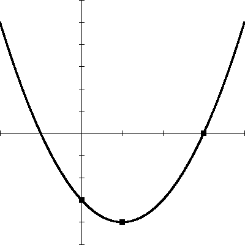

::: {.problem num="1" type="choice" space="1cm"}
함수 \(f(x)=x^{2}-4x+1\)의 최솟값은?

::: choices
① \(-4\)
② \(-3\)
③ \(-2\)
④ \(-1\)
⑤ \(0\)
:::

::: answer
②
:::
:::

::: {.problem num="2" type="choice" space="1cm"}
이차방정식 \(x^{2}-4x+3=0\)의 해는?

::: choices
① \(x=1\) 또는 \(x=3\)
② \(x=-1\) 또는 \(x=3\)
③ \(x=1\) 또는 \(x=-3\)
④ \(x=-1\) 또는 \(x=-3\)
⑤ \(x=2\) 또는 \(x=3\)
:::

::: answer
①
:::
:::

::: {.problem num="3" type="choice" space="1cm"}
다음 중 옳은 것은?

::: choices
① 모든 정사각형은 직사각형이다.
② \(\sqrt{4}\)는 무리수이다.
③ \(\dfrac{1}{3}\)은 순환하지 않는 무한소수이다.
④ 두 무리수의 합은 항상 무리수이다.
⑤ \(0\)은 자연수이다.
:::

::: answer
①
:::
:::

::: {.problem num="4" type="choice" space="1cm"}
실수 \(a\), \(b\)에 대하여 \<보기\>에서 옳은 것만을 있는 대로 고른 것은?

::: bogi
ㄱ. \(a>0\)이고 \(b>0\)이면 \(ab>0\)이다.
ㄴ. \(a^{2}=b^{2}\)이면 \(a=b\)이다.
ㄷ. \(|a|+|b| \geq |a+b|\)이다.
:::

::: choices
① ㄱ
② ㄴ
③ ㄱ, ㄴ
④ ㄱ, ㄷ
⑤ ㄱ, ㄴ, ㄷ
:::

::: answer
④
:::
:::

::: {.problem num="5" type="short" space="3cm"}
\(\int_{0}^{2}\left(3x^{2}-2x\right)dx\)의 값을 구하시오.

::: answer
4
:::
:::

::: {.problem num="6" type="short" space="3cm"}
다음은 어느 반 학생 20명의 수학 점수를 조사하여 나타낸 도수분포표이다. \(a\)의 값을 구하시오.

| 점수(점) | 학생 수(명) |
|:---:|:---:|
| \(50\) 이상 \(\sim\) \(60\) 미만 | \(3\) |
| \(60\) 이상 \(\sim\) \(70\) 미만 | \(a\) |
| \(70\) 이상 \(\sim\) \(80\) 미만 | \(7\) |
| \(80\) 이상 \(\sim\) \(90\) 미만 | \(4\) |
| \(90\) 이상 \(\sim\) \(100\) 미만 | \(2\) |

::: answer
4
:::
:::

::: {.problem num="7" type="essay" space="8cm"}
등차수열 \(\{a_{n}\}\)에서 \(a_{3}=7\), \(a_{7}=19\)일 때, 일반항 \(a_{n}\)을 구하는 과정을 서술하시오.

::: answer
\(a_{n}=3n-2\)
:::
:::

::: {.problem num="8" type="choice" space="1cm"}
그림은 꼭짓점이 \((1,-4)\)이고 점 \((3,0)\)을 지나는 이차함수 \(y=f(x)\)의 그래프이다. \(f(0)\)의 값은?

{width=4.1cm}

::: choices
① \(-5\)
② \(-4\)
③ \(-3\)
④ \(-2\)
⑤ \(-1\)
:::

::: answer
③
:::
:::

::: {.group range="9~10"}
두 함수 \(f(x)=2x+1\), \(g(x)=x^{2}-3\)에 대하여 다음 물음에 답하시오.

::: {.problem num="9" type="choice" space="1cm"}
\((g \circ f)(1)\)의 값은?

::: choices
① \(4\)
② \(5\)
③ \(6\)
④ \(7\)
⑤ \(8\)
:::

::: answer
③
:::
:::

::: {.problem num="10" type="short" space="3cm"}
\((f \circ g)(x)=5\)를 만족시키는 양수 \(x\)의 값을 구하시오.

::: answer
\(\sqrt{5}\)
:::
:::
:::

::: {.problem num="11" type="choice" space="1cm" source="샘플 교재 52쪽 1203번"}
두 집합 \(A=\{1,2,3\}\), \(B=\{2,3,4\}\)에 대하여 \(n(A \cup B)\)의 값은?

::: choices
① \(2\)
② \(3\)
③ \(4\)
④ \(5\)
⑤ \(6\)
:::
:::

::: {.problem num="12" type="choice" space="1cm"}
함수
\[f(x)=\begin{cases} x+a & (x<1) \\ x^{2}-2 & (x \geq 1) \end{cases}\]
가 \(x=1\)에서 연속일 때, 상수 \(a\)의 값은?

::: choices
① \(-3\)
② \(-2\)
③ \(-1\)
④ \(0\)
⑤ \(1\)
:::

::: answer
②
:::
:::
